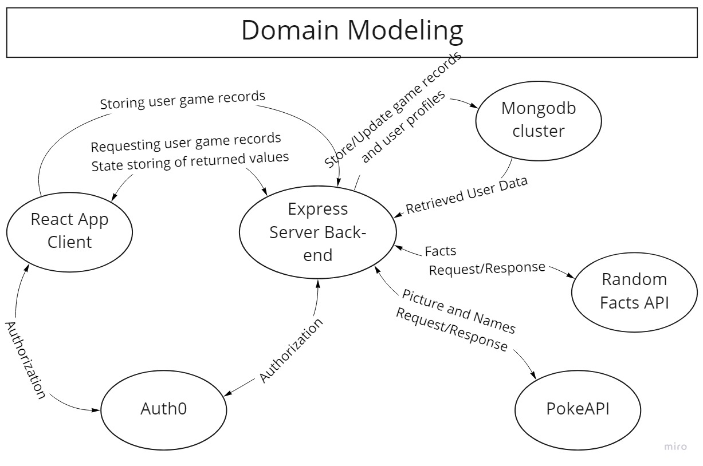
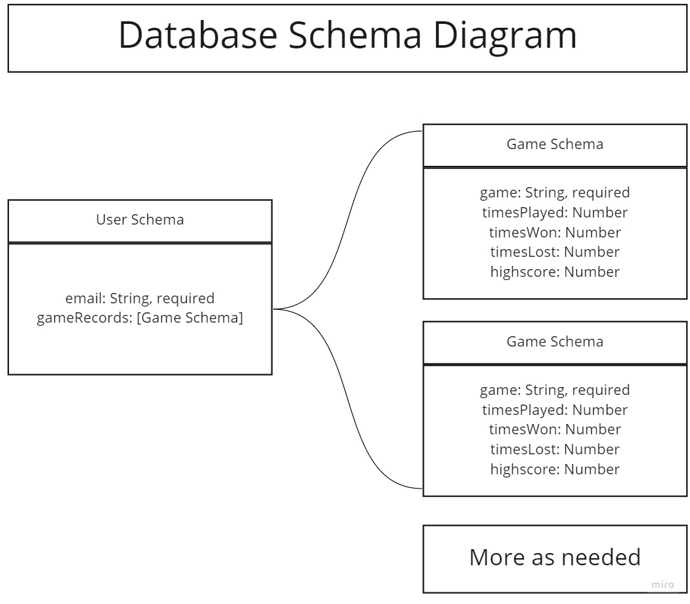
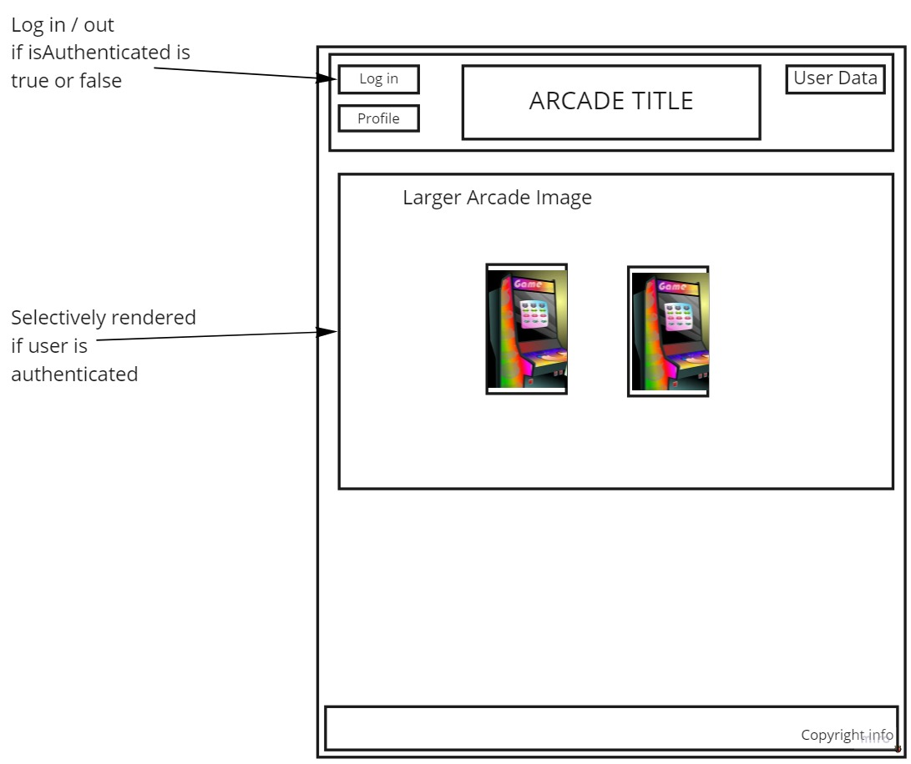
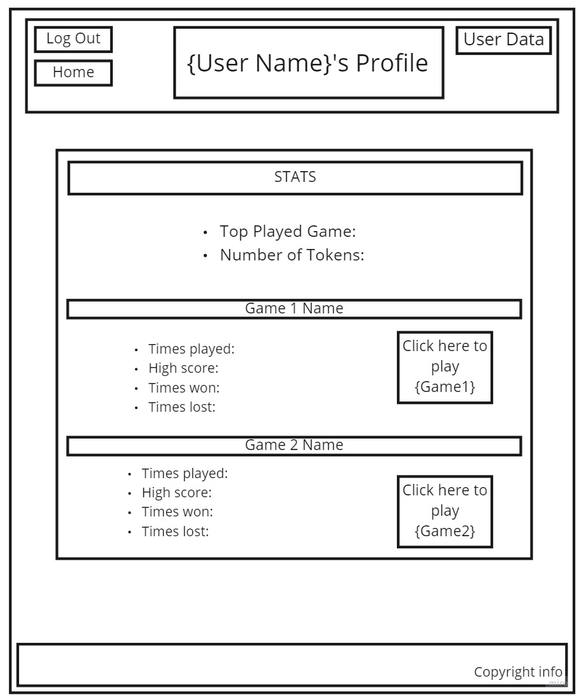
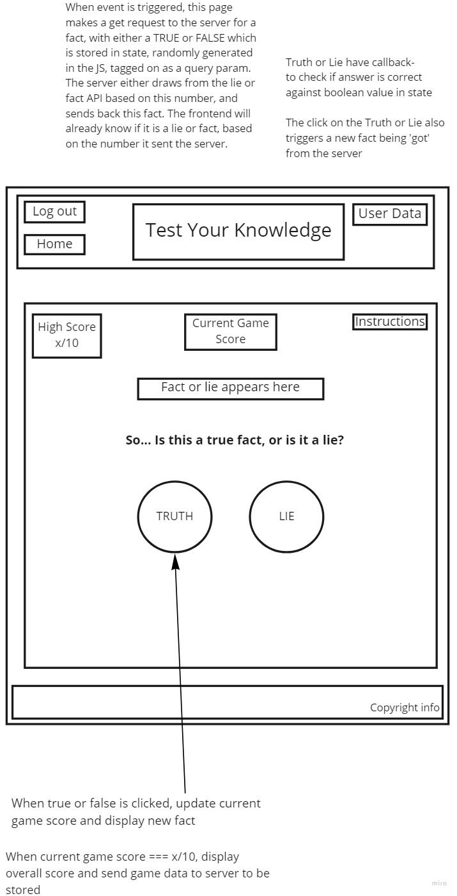

# Deck-Frontend

## Description of project:

This project is made for entertainment purposes. The overall idea is that it will be a "hub" of sorts which will mimic the styling of an arcade. Our app will house multiple different games, should we reach our stretch goals.

## Team members:
- Keian Anthony
- Charles Bofferding
- Peyton Mader
- Quentin Cruz

Domain Modeling:

Schema Diagram:

Wireframe:

## Acknowledgments and credits:

- [This](https://fdossena.com/?p=html5cool/buttons/i.frag) link was used for button styling on login/logout in the header
- [This](https://fonts.google.com/specimen/Space+Mono?category=Monospace&preview.text=Font%20test%20for%20the%20website&preview.text_type=custom) font used for header text styling
- [This](https://fonts.google.com/specimen/Hind+Siliguri?category=Sans+Serif#standard-styles) font used for paragraphs and text within the components