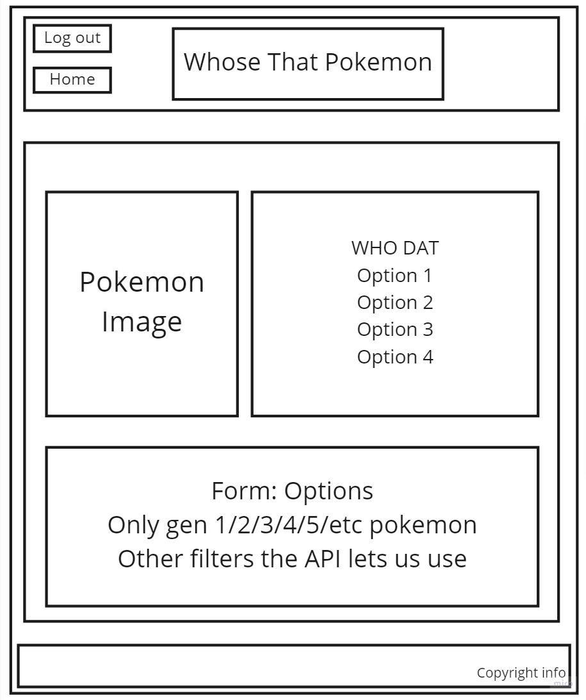

# Deck-Frontend

## Description of project:

This project is made for entertainment purposes. The overall idea is that it will be a "hub" of sorts which will mimic the styling of an arcade. Our app will house multiple different games, should we reach our stretch goals.

## Team members:
- Keian Anthony
- Charles Bofferding
- Peyton Mader
- Quentin Cruz

Domain Modeling:

Schema Diagram:

Wireframe:

